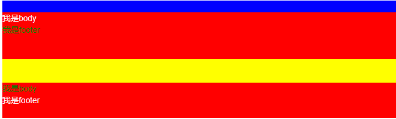

# 0. 题外话

## 0.1 问：为什么要在body里面引入js？

答：

* 要在body的结尾处添加
* 因为html渲染的顺序是从上到下，如果遇到script就会去解析
* 如果遇到太大的script，就会造成暂时的白屏，给用户一种很不好的感受

## 0.2 问：JavaScript new对象的四个过程

* new对象

  ```JS
  function Person(name,age){
       this.name=name;
       this.age=age;
  }
  var person=new Person("Alice",23);
  ```

* new 一个对象的四个过程：

  * 创建一个空对象

  ```JS
  var obj = new Object();
  ```

  * 让Person中的this指向obj，并执行Person的函数体

  ```JS
  var result = Person.call(obj);
  ```

  * 设置原型链，将obj的`__proto__`成员指向了Person函数对像的prototype成员对象

  ```JS
  obj.__proto__ = Person.prototype
  ```

  * 判断Person的返回值类型，如果是值类型，返回obj。如果是引用类型，就返回这个引用类型对象

  ```JS
  if(typeof(result)=="object")
       person=result;
  else
       person=obj;
  ```

  

# 1. Vue基础

本笔记记录的全是干货，过多的寒暄的话就不多说了，直接上重要的代码！

## 1.1 安装方式

方式1：采用本地文件引入的方式

方式2：采用 **`在线cdn`**（相当于把文件存入到一个库，调用的时候就近给你调用）引入的方式

方式3：采用 **`npm`** 安装的方式 


## 1.2 使用方式

> 1. body中,设置Vue管理的视图 `<div id="app"></div>`
> 2. 引入vue.js
> 3. 实例化Vue对象 new Vue();
> 4. 设置Vue实例的选项:如el、data...     
> 	new Vue({选项:值});
> 5. 在`<div id='app'></div>`中通过{{ }}使用data中的数据


## 1.3 实例选项

* el
  * 作用:当前Vue实例所管理的html视图
  * 值:**`通常`**是id选择器(或者是一个 HTMLElement 实例)  因为后边所有的项目都是id选择器 而且el一旦确定,就不再更改
  * **`不要让el所管理的视图是html或者body!`**
  * class选择器 只匹配第一个满足条件的元素 (Vue实例 => 管理视图 1对1)
* data
  * Vue 实例的数据对象，是响应式数据(数据驱动视图) 数据变化 => 视图变化
  * 可以通过 `vm.$data` 访问原始数据对象
  * Vue 实例也代理了 data 对象上所有的属性，因此访问 `vm.a` 等价于访问 `vm.$data.a`
  * 视图中绑定的数据必须**`显式`**的初始化到 data 中
  * 数据对象的更新方式 直接 采用 **实例.属性 = 值**
* methods
  * methods是一个**`对象`**
  * 可以直接通过 VM 实例访问这些方法，或者在**`插值表达式中使用`**。
  * 方法中的 `this` 自动绑定为 Vue 实例。
  * methods中所有的方法 同样也被代理到了 Vue实例对象上,都可通过this访问
  * 在data中命名时 不能和methods中的方法重名
  * 注意，**不应该使用箭头函数来定义 method 函数** (例如 `plus: () => this.a++`)。理由是箭头函数绑定了**`父级作用域`**的上下文，所以 `this` 将不会按照期望指向 Vue 实例，`this.a` 将是 undefined

##  1.4 插值表达式

> 1.作用:会将绑定的数据实时的显示出来: => 数据变化  => 所有绑定插值表达式的部分都会更新
>
> 2.形式: 通过 **`{{ 插值表达式 }}`**包裹的形式 
>
> 3.通过任何方式修改所绑定的数据,所显示的数据都会被实时替换(**响应式数据**)**数据驱动视图**
>
> 4.**`需要注意的是`**Vue实例上代理里 data中所有的属性 和 methods中的方法,而我们的el作用的视图直接可使用这些**`属性和方法`**  但是并不需要**`写this.属性 和 this.方法()`** 
>
> 5.**`注意`**:不能写 `var a = 10; 分支语句 循环语句`


## 1.5 v-text/v-html/{{ 插值表达式 }}

* v-text
  * 更新整个标签中的内容，相当于`innerText`
* v-html
  * 可以渲染到页面（不建议使用，会造成XSS跨站脚本攻击）相当于`innerHtml`
* {{ 插值表达式 }}
  * 只是更新局部作用域内的内容

## 1.6 v-if/v-show

* v-if

  * 元素的删除与增加
  * `适用于：`运行时条件很少改变
  * `缺点：`更高的切换开销

* v-show

  * style="display:none" 样式来决定
  * `适用于：`标签显示与隐藏切换频繁
  * `缺点：`更高的初始渲染开销

  问：如果有多个元素需要使用v-if或者v-show控制，但是又不能增加外部额外的标签怎么办？

  答：可以使用`template`标签进行包裹多个元素


## 1.7 v-on事件绑定

> - 使用: 绑定 v-on:事件名.修饰符="方法名"   可使用 @事件名="方法名的方式"
> - **注意** 方法名 中 可以采用$event的方式传形参  也可以直接写事件名 默认第一个参数为event事件参数
> - 修饰符(可不写)
>   - `.once` - 只触发一次回调。
>   - `.prevent` - 调用 `event.preventDefault()`。
> - 事件传参有两种形式 
>   - 匿名传参  =>当`只写`方法名时 =>  方法中默认第一个参数就是event(事件参数)
>   - 显示传参 => 当写方法名() => 如果想要获取event,必须显示的用$event传到方法里
>     - 方法名写括号和不写括号是有区别滴!!!!

### 1.7.1 补充（input中change事件与input中input事件）

* input中change只有失去光标时才会执行
* input中input时间只要数据变化就会执行

##  1.8 v-for / v-for-key

* v-for

  * `item in items` 或者 `item of items`   // item为当前遍历属性数组项的值

  * (item,index) in items   //item为当前遍历属性数组项的值 index为数组的索引

*  v-for-key

    * 使用: 通常是给列表数据中的唯一值 也可以用**`索引值`**
    
    * key通常是一个唯一值 => 身份证(循环项的身份证)
    
    * :属性="表达式" => 后面的表达式是变量
    
    * 属性="123"
    
        ```js
         <li v-for="(item,index) in list" :key="index">{{item}}---{{index}}</li>
        ```
    
    
    > 问：如果遇到循环，我们应该将v-for写在哪里呢？
    >
    > 答:   应该是重复的标签上  不是其父级元素上
## 1.9 v-for-数组/对象

* 数组
  * item in items   // item为当前遍历属性数组项的值
  * (item,index) in items   //item为当前遍历属性数组项的值 index为数组的索引
* 对象
  * item in items  // item为当前遍历属性对象的值
  * (item, key, index) in  items //item为当前遍历属性对象的值 key为当前属性名的值  index为当前索引的值

## 1.10 v-if与v-for相遇

> 问：v-for循环元素时,标签可使用item属性, 如果这个时候用v-if来进行操作 会产生什么效果?
>
> 例：`<p v-if="index>1" v-for="(item,index) in list"></p>`
>
> 结果： 以上代码执行: 会将数组中前两个元素忽略掉
>
> 说明：v-for 的优先级大于v-if ,所有v-if才能使用v-for的变量

## 1.11 v-bind

* 作用：
  
  * 绑定标签上的任何属性
  
* 语法：
  
  * `<p v-bind:属性="数据对象中的属性名"></p>`
 ### 1.11.1 v-bind-绑定class -`对象`语法

* 语法：
  * 绑定class对象语法    :class="{ class名称": 布尔值 }"
  * `<p :class="{left:showClass}">内容</p>`

### 1.11.2 v-bind-绑定class -`数组`语法

- 语法：
  - 绑定class数组语法 :class="[class变量1,class变量2..]"
  - `<p :class="[activeClass,selectClass]" class="default">内容</p>`


### 1.11.3 v-bind-绑定`style-对象`语法

- 语法：
  - :style="{css属性名: 变量}"
  - `<p :style="{fontSize:fontsize}"></p>`

### 1.11.4 v-bind-绑定`style-数组`语法

- 语法：

  - :style="[对象1,对象2...]"
- 注意：对象可以是多个属性的 集合  同样里面的css属性需要遵从小驼峰命名的规则

  

## 1.12 v-model

* 作用

  * **`表单元素`**的绑定
* 特点

  * 数据发生变化可以更新到界面 => 响应式数据
  * 通过界面可以更改数据  => 表单数据变化 => viewmodel => 数据
  * ` v-model` 会忽略所有表单元素的 `value`、`checked`、`selected` 特性的初始值而总是将 Vue 实例的数据作为数据来源。应该在 `data`选项中声明初始值。
* 使用技巧：
  * v-model.lazy （变懒=>失去焦点显示）
  * v-model.number (能转换number就转，不能转换number就不转)
  * v-model.trim （去首位空格）

###  1.12.1 语法糖

* 通过v-on指令和 v-bind指令 组合实现v-model效果

  ```JS
  <body>
      <div id="app">
          <p>{{ name }}</p>
          <input @input="changeMsg" type="text" :value="name">
      </div>
      <script src="../vue.js"></script>
      <script>
          var vm = new Vue({
              el: '#app',
              data: {
                  name: "",
              },
              methods: {
                  changeMsg() {
                      this.name = event.target.value;
                  }
              }
          });
      </script>
  </body>
  ```

###  1.12.2-v-model-绑定其他表单元素

表单元素:  input  textarea checkbox radio  select 

注意：

*  checkbox在input标签中需要给定value值
* 所有表单元素一旦绑定了 v-model  就会忽略掉 原有的value值 checked值 selected值  需要从数据对象中取默认值

##  1.13 v-cloak

* 场景
  
  * 解决页面初次渲染时 页面模板闪屏现象
  
* 解决
  * 1.编写元素标签
  
  * 2.写入v-cloak指令
  
    * ```CSS
      [v-cloak]{
          display:none
      }
      ```
  
  * 3.将v-cloak指令 属性加上style
  
* 注意

  > 问：既然是加入属性选择器标签，那么为什么必须写v-cloak，不能使用其他名称么？
  >
  > 答:  不能写其他的名称，因为vue只认它

## 1.14 v-once

* 作用：

  * 使得所在元素只渲染一次  
* 补充事件修饰符
  * 阻止冒泡.stop =>e.stopPropagation();
  * 阻止默认行为 .prevent=>e.preventDefault();
  * 点了当前元素才会触发（触发源是自己的时候）.self
  * 只渲染一次 .once
  * 按下回车执行 .center（其他关键按钮，同理可证，键值也可以设置）

## 1.15 过滤器

> - 场景: data中的数据格式(日期格式/货币格式/大小写等)需要数据时
> - 使用位置:{{}}和v-bind="表达式 | 过滤器名称"
> - 具体用法:{{msg | 过滤器名字}}
> - 分类:**`本地(局部)`**和全局  全局 **`所有实例`**均可使用  Vue  局部过滤器 只有**`当前实例`**才可以使用
> - 本地: 通过el/data/methods**`选项`**filters
> - 局部和全局的区别 => 注册位置不同,应用范围不同
> - 全局: 在new Vue上面 Vue.filter()  => 所有实例都可以使用
> - 局部: 在Vue实例上 的选项上 filters => 所有过滤器集合 =>当前实例使用

* 全局过滤器

  * 在创建 Vue 实例**`之前`**定义全局过滤器Vue.filter()

  * Vue.filter('该过滤器的名字',(要过滤的数据)=>{return 对数据的处理结果});

  * 在视图中通过{{数据 | 过滤器的名字}}或者v-bind使用过滤器

    ```JS
    Vue.filter("toUpper", function(value) {
    	return value.charAt(0).toUpperCase() + value.substr(1);
    });// 过滤器核心代码
    ```

* 局部过滤器

  * 在vm对象的选项中配置过滤器filters:{}

  * (key)过滤器的名字: (value)(要过滤的数据)=>{return 过滤的结果}

  * 在视图中使用过滤器:  {{被过滤的数据 | 过滤器的名字}}

    ```js
    filters: {
        toUpper(value) {
          return value.charAt(0).toUpperCase() + value.substr(1);
        }
    }
    ```

* `注意： `

  * `局部过滤器只能用在当前Vue实例视图上`
  * `过滤器可以传递参数,第一个参数永远是前面传递过来的过滤值`
  * `过滤器也可以多个串行起来并排使用`
  
    

## 1.16 ref 操作 DOM

* 作用: 通过ref特性可以获取元素的dom对象
* 使用:  给元素定义 ref属性, 然后通过$refs.名称 来获取dom对象
* $refs是Vue实例的属性 
* $data/$event => $开头的属性和方法都是Vue实例的方法和属性

```JS
<input type="text" ref="myInput" /> // 定义ref
    
focus() {
	this.$refs.myInput.focus();
}  // 获取dom对象 聚焦
```

## 1.17 自定义指令

* 全局自定义指令

  * 在创建 Vue 实例之前定义全局自定义指令  Vue.directive()

  * 表达式对象 => value  => 表达式计算结果的值

  * 在视图中通过"v-自定义指令名"去使用指令

  * 指令名称要全小写

    > // 定义指令
    > // 自定义指令是不需要加v-前缀的
    > // 第二个参数为一个`对象`  对象中要实现 inserted的方法
    > // inserted中的参数为当前指令所在元素的dom对象
    > Vue.directive("focus", {
    >         inserted(dom,expression) {
    >           dom.focus();
    >         }
    >  });

* 局部自定义指令

  * 需要注册在`当前实例`上

  * `directives`这里注意是带s的与全部自定义指定名称不同

    > `directives`: {
    >
    > ​                htmlcopy: {
    >
    > ​                    inserted(dom, expression) {
    >
    > ​                        dom.innerHTML = expression.value;
    >
    > ​                    }
    >
    > ​                }
    >
    > ​            }

## 1.18 计算属性

- 场景:当(插值表达式/v-bind表达式)过于复杂的情况下 可以采用计算属性 对于任何**`复杂逻辑`**都可以采用计算属性,**`简单逻辑也可以采用计算属性`**

- 使用: 在Vue实例选项中 定义 computed:{ (key)计算属性名: **`带返回值`**的函数 }

- 说明: 计算属性的值 依赖 数据对象中的值  数据对象发生改变 => 计算属性发生改变=> 视图改变

  ### 1.12.8.1 计算属性与方法的区别

  > - methods 每次都会执行  
  > - 计算属性 每计算一次 都会讲结果`缓存`,如果 data中的数据没变化,则直接从缓存中取数据
  > - 如果 data中变化了 , 则会执行 新的计算方法 => 缓存
  > - 计算属性 会每次比较**`data更新`**前后的值 如果前后一致 则不会引起视图变化
  > - methods每次都会执行 `性能`较计算属性`较差`
  > - 计算属性是有`缓存机制`的,更智能化 ,更有`效率`
  > - 计算属性直接名称，方法除了名称之外还要有（）括号

  ### 1.12.8.2 计算属性与方法的基本使用

  > - 由于计算属性中 要return 值 => 立刻返回 => 同步/异步 => 计算属性方法 => **`必须写同步代码`**
  > - **`ajax/setTimeout`**  不能写在计算属性中

  >  computed: {
  >
  > ​                //通过计算属性实现**`字符串的翻转`**
  >
  > ​                fanzhuan() {
  >
  > ​                    return this.content.split("").reverse().join("");
  >
  > ​                },
  >
  > ​	}

##  1.19 Vue中实现发送网络请求

1. vue-resource: Vue.js的插件，已经不维护，不推荐使用
2. [axios](https://www.kancloud.cn/yunye/axios/234845) :**不是vue的插件**，可以在任何地方使用，

```js
//-----------------------------*************-------------------
// promise 是为了解决回调
$.ajax({
 url:'',
 data:{},
 success:function(data){
     // data为后端响应回来的数据
     $.ajax({
         url:''
         data:data,
         success:function(data1){
          $.ajax({
              url:'',
              data:data,
              success:function(data2){
                  
              }
          })  
       }
     })
 }
})
// -----------------------------*************-------------------
new Promise(function(resolve,reject){ 
 if(flag === 1) {
       resolve("success")  // 正确执行  返回一个字符串 success
 }else {
     reject(new Error("fail")) // reject 抛出错误 throw一个错误
 } 
}).then(result => {
  return  axios({url,data:result }) // 第一个请求 生成result1
}).then(result1 => {
  return axios(url,data:result) // 第二个请求生成result2
}).then(result2 => {
  return axios({url,data:result}) //第三个请求result3
}).then(result3 => {
  return axios({})
}).catch(err=>{
  
})
// 链式调用
// 如果reject  相当于执行失败 =>  执行失败=>不会进入到then => 会进入到promise的catch
// -----------------------------*************-------------------
//axios 返回的是一个promise对象 
axios ===  new Promise(function(reslove,reject){
       
})
axios().then(拿到返回数据(接口返回数据)).catch(err=> )
```

## 1.20 RESTFUL的接口规则

> - RESTful是一套**`接口设计规范`**
> - 用**`不同的请求类型`**发送**`同样一个请求标识`** 所对应的处理是`不同的`
> - 同样的请求标识 => 相同的请求地址**`url`**
> - 通过Http请求的不同类型(POST/DELETE/PUT/GET)来判断是什么业务操作(CRUD ) 
> - CRUD => 增删改查 => C =>Create(增)  R => Read(查)    U => UPDATE(改)  D =>DELETE(删)
> - json-server应用了RESTful规范

**HTTP方法规则举例**

| **HTTP方法** | **数据处理** | **说明**                                           |
| ------------ | ------------ | -------------------------------------------------- |
| POST         | Create       | 新增一个没有id的资源                               |
| GET          | Read         | 取得一个资源                                       |
| PUT          | Update       | 更新一个资源。或新增一个含 id 资源(如果 id 不存在) |
| DELETE       | Delete       | 删除一个资源                                       |

1. 查询数据  GET  /brands 获取db.json下brands对应的所有数据 **`列表`**
2. GET /brands/1 查询id=1数据 **`单条`**
3. 删除数据 DELETE   /brands/1 删除id=1数据
4. 修改数据 PUT  /brands/1 请求体对象 {name:'李四' }
5. 上传/添加 POST /brands 请求体  {name:'李四'}

​     6.   查询 GET /brands?title_like=关键字  -> 模糊搜索

## 1.21 axios

* Axios 是一个基于 promise 的 HTTP 库，简单的讲就是可以发送get、post请求。
  * 特点：
    * 1、可以在浏览器中发送 XMLHttpRequests
    * 2、可以在 node.js 发送 http 请求
    * 3、支持 Promise API
    * 4、拦截请求和响应
    * 5、转换请求数据和响应数据
    * 6、能够取消请求
    * 7、自动转换 JSON 数据
    * 8、客户端支持保护安全免受 XSRF 攻击
* 除去post请求 ,所有接口的正确请求返回码都是**`200`** 但是post的状态码是**`201`**

```JS
//get请求：
axios.get('http://localhost:3000/brands')
.then(res => {
console.log(res.data);
})
.catch(err => {
console.dir(err)
});
```

```JS
//delete请求：
axios.delete('http://localhost:3000/brands/109')
.then(res => {
console.log(res.data);
})
.catch(err => {
console.dir(err)
});
```

```js
//post请求
axios.post('http://localhost:3000/brands', {name: '小米', date: new Date()})
.then(res => {
console.log(res);
})
.catch(err => {
console.dir(err)
});
```

## 1.22 watch

* 当需要根据**`数据变化`** 进行相应业务操作,且该操作是**`异步操作`**时,**`计算属性不能再使用`**,可以使用监听watch特性

- watch=> 是监听data数据 中数据项的变化对象 => data中数据变化  => watch 监控函数执行 =>监控函数 
- 监控函数 =>  newValue.oldValue
- watch选项不需要返回值 不需要return  只需要在函数体中执行对应的逻辑即可\
- watch:  {  data属性名(监视谁写谁的名字): function(newValue(新值),oldValue(旧值)){} } 

##  1.23 组件

* 组件特点: 
  * 组件是一个**`特殊的 Vue实例`**
  * vue实例有**`el`**选项  组件实例没有el 但是**`templete`**页面结构
  * template 代表其页面结构 (**`有且只要一个根元素`**)
  * 每个组件都是**`独立`**的 运行作用域  **`数据 逻辑没有任何关联`**
  * 和实例相似之处:   data/methods/computed/watch  等一应俱全  
* 注意 
  * 不能和已有的标签名重名
  * 命名规范 （单词全小写）
    *  abc
    * abc-b
  * data是一个函数带有返回值的函数，并不在是一个对象
  
###  1.23.1 全局组件

```JS
      Vue.component("content-a", {
        template: `<div>
       				 {{count}}
       			   </div>`,
        data() {
          return {
            count: 1
          };
        }
      });
```

  ### 1.23.2 局部组件

```JS
        new Vue({
            el: "#app",
            data: {},
            methods: {},
            components: {
                "content-a": {
                    template: `
							<div>
								{{count}}
							</div>`,
                    data() {
                        return {
                            count: 1
                        };
                    }
                }
            })
```

### 1.23.3 组件嵌套

> - 我们可以在new Vue()实例中使用自定义组件,
> - 可以在组件中注册组件
> - **`在谁的组件对象中注册,就只能在谁的模板里使用该标签(局部)`**
> - 也可以在注册自定义组件时,嵌套另一个自定义组件,也就是父子组件的关系
> - 组件嵌套 =>  大组件 => 若干个小组件 =>  更多小组件  => 各司其职

因为出现了父子组件的关系，那么必然会存在父子之间的通信：

* 父组件 =>子组件   需要将数据传给子组件
* 子组件 => 父组件  如果父组件需要 子组件也可以传数据给父组件
* 兄弟组件1 =>兄弟组件2

#### 1.23.3.1 父=>子传值(props)

* props的作用：接收父组件传递的数据

* props就是父组件给**`子组件标签`**上定义的**`属性`**

  * props是组件的选项  定义接收属性
  2. props的值可以是字符串数组 props:["list"]  
  3. props数组里面的元素称之为prop(属性) 属性=?值
  4. prop的值来源于外部的(组件的外部)
  5. prop(我们这里是lists)是组件的属性->自定义标签的属性
  6. prop的赋值位置(在使用组件时,通过标签属性去赋值)
  7. prop的用法和data中的数据用法一样

  ```js
  //实例： 父=>子传值
  <!-- 父子传值 -->
      <div id="app">
          <cityname :citylist="citylist"></cityname>
      </div>
      <script src="../vue.js"></script>
      <script>
          Vue.component('cityname', {
              template: `
                  <div>
                      <ul>
                          <li v-for="(item,index) in citylist" :key='index'>{{item}}</li>
                      </ul>
                  </div>
              `,
              props: ["citylist"],// props可以是数组  也可以是对象
          })
          var vm = new Vue({
              el: '#app',
              data: {
                  citylist: ["哈尔滨", "齐齐哈尔", "松花江"]
              },
              methods: {}
          });
      </script>
  ```

#### 1.23.3.2 子=>父传值(自定义事件)

* 通过在子组件中触发**`$emit`**事件,然后在当前组件实例中监视此事件

* **`$emit是在当前组件实例抛出一个事件`**

* **`监听谁的实例事件,就写在谁的标签上`**

* `$emit触发的事件,只能在当前实例监听,因为是在当前实例触发的`

*  `注意 !!!!!!!!!!!!!  如果props有驼峰命名的情况 赋值时  需要拆成- 分割的形式 否则无法传递`

* **抛出事件名必须为全小写**

  ```js
  <!-- 子=>父亲传值 -->
      <div id="app">
          <zizujian @datatofather="getFromContent"></zizujian>
          我是来自于子元素---<span>{{ name }}</span>
      </div>
      <script src="../vue.js"></script>
      <script>
          var vm = new Vue({
              el: '#app',
              data: {
                  name: '',
              },
              methods: {
                  getFromContent(content) {
                      this.name = content;
                  }
              },
              //1.创建子组件
              components: {
                  "zizujian": {
                      template: `
                          <div>
                              <span>我是局部(子)的信息，我将要将我自己传递到父亲那里</span>
                              <p></p>
                              <button @click="dataTrigger">点击</button>    
                          </div>
                      `,
                      data() {
                          return {
                              content: "来了，子组件!",
                          }
                      },
                      methods: {
                          //dataTrigger点击按钮，进行数据传递触发
                          dataTrigger() {
                              //emit有若干个参数，第一个参数为自定义方法名，其余的参数均为要传递的数据
                              this.$emit('datatofather', this.content)
                          }
                      }
                  },
              }
          });
      </script>
  ```

### 1.23.4 组件分类

  - 路由级别组件：挂在路由上的组件
  - 普通组件: 在路由级中使用的组件叫做普通组件

##  1.24 SPA（single page application）单页面应用

SPA与传统模式对比：

* SPA
  * 优点
    * 速度快,**`切换模块不需要经过网络请求`**,**`用户体验好`**,因为前段操作几乎感受不到网络的延迟
    * 完全**`组件化`**开发 ,由于**`只有一个页面`**,所以原来属于一个个页面的工作被归类为一个个**`组件`**.
  * 缺点
    * **`首屏加载慢`**->**`按需加载`** 不刷新页面只请求js模块
    * **`不利于SEO`**->**`服务端渲染`**(node->自己写路由->express-art-template+res.render())
* 传统模式
  * 缺点
    * 每个页面及其内容都需要从服务器**`一次次请求`**  如果网络差, 体验则会感觉很慢

实现原理：

* 可以通过页面地址的**`锚链接`**来实现
* hash(锚链接)位于链接地址 **`#`**之后
* hash值的改变**`不会触发`**页面刷新
* hash值是url地址的一部分,会存储在页面地址上 我们**`可以获取`**到
  * 通过===>`location.hash`来获取 
* 可以通过**`事件监听`**hash值得改变
* 拿到了**`hash值`**,就可以根据不同的hash值进行不同的**`模块切换`**

## 1.25 路由

```js
//js实现前端路由
<a href="#heb">哈尔滨</a>
    <a href="#qqhe">齐齐哈尔</a>
    <a href="#dq">大庆</a>
    <a href="#sh">绥化</a>
    <div></div>

    <script>
        var fun = function () {
            url = location.hash.substr(1);
            var div = document.getElementsByTagName("div");
            switch (url) {
                case "heb":
                    div[0].innerText = "哈尔滨";
                    break;
                case "qqhe":
                    div[0].innerText = "齐齐哈尔";
                    break;
                case "dq":
                    div[0].innerText = "大庆";
                    break;
                case "sh":
                    div[0].innerText = "绥化";
                    break;
                default:
                    break;
            }
        }
        window.onhashchange = fun;
        fun();
    </script>
```

### 1.25.1 vue-router初识

* Vue-Router 是 [Vue.js](http://cn.vuejs.org/) 官方的**`路由管理器`**。它和 Vue.js 的核心深度集成，让构建单页面应用变得易如反掌 
* 实现根据不同的**`请求地址`** 而**`显示不同的组件`**
* 如果要使用 vue开发项目,**`前端路由`**功能**`必须使用`**vue-router来实现

### 1.25.2 vue-router使用（7个步骤）

* 引入vue-router.js
* 设置导航`<router-link></router-link>`
* 创建容器` <router-view></router-view>`
* 实例化路由对象`var router = new VueRouter({ })`
* 配置路由表 path/compoent
* 挂在路由

```js
//实例
<div id="app">
        <router-link to="/bd">百度</router-link>
        <router-link to="/xl">新浪</router-link>
        <router-view></router-view>
    </div>
    <script src="../vue.js"></script>
    <script src="../vue-router.js"></script>
    <script>
        var router = new VueRouter({
            routes: [{
                path: "/",
                component: {
                    template: `<div>无</div>`
                }
            }, {
                path: "/bd",
                component: {
                    template: `<div>百度</div>`
                }
            }, {
                path: "/xl",
                component: {
                    template: `<div>新浪</div>`
                }
            }]
        });
        var vm = new Vue({
            el: '#app',
            data: {},
            methods: {},
            router
        });
    </script>
```

### 1.25.3 动态路由

如何理解动态路由

* 点击**`列表页`** 跳转到**`详情页`**时,跳转的链接需要**`携带参数`**,会导致**`页面path`**不同
* 当**`页面path不同`**却需要对应**`同一个组件`**时,需要用到**`动态路由`**这一概念

动态路由实现代码：

```JS
//案例实现：
<div id="app">
        <router-link to="/company/百度">百度</router-link>
        <router-link to="/company/新浪">新浪</router-link>
        <router-link to="/company/腾讯">腾讯</router-link>
        <router-link to="/company/饿了么">饿了么</router-link>
        <router-view></router-view>
    </div>
    <script src="../vue.js"></script>
    <script src="../vue-router.js"></script>
    <script>
        var router = new VueRouter({
            routes: [{
                path: '/company/:content',
                component: {
                    template: `<div>{{ $route.params.content }}--公司真的很棒<div>`
                }
            }, ]
        })
        var vm = new Vue({
            el: '#app',
            data: {},
            methods: {},
            router
        });
    </script>
```

###  1.25.4 vue-router-to属性赋值

```JS
 	  <!-- 常规跳转 -->
	  <router-link to="/sport">体育</router-link>
      <!-- 变量 -->
      <!-- <router-link :to="path">体育</router-link>
      <!-- 根据对象name跳转 -->
      <!-- <router-link :to="{name:'abcdefg'}">体育</router-link>
      <!-- 根据对象path跳转 -->
      <!-- <router-link :to="{path:'/sport'}">体育</router-link>
      <!-- 带参数的跳转 -->
      <router-link :to="{name:'abcdefg',params:{a:1}}">体育</router-link>
```

### 1.25.5 vue-router-重定向

* 概述：想拦截谁就在谁的路由中写redirect

```js
//代码实现：
{
    path: '/heb',
    redirect: '/bj',
    component: {
    	template: `
              <div>哈尔滨</div>
                  `,
    }
},
//上述代码中，本意是需要跳转到/heb，但是因为有重定向固然跳转到了/bj中
```

### 1.25.6 vue-router-编程式导航

* 路由对象的实例方法 有 push  replace, go()  
* push 方法 相当于往历史记录里推了一条记录 如果点击返回 会回到上一次的地址  相当于 to属性
* replace方法 相当于替换了当前的记录  历史记录并没有多 但是地址会变
* go(数字) 代表希望是前进还是回退,当数字大于0 时 就是前进 n(数字)次,小于0时,就是后退n(数字)次

`可以通过vue实例 获取当前的路由实例 $router `

```JS
//代码
goPage() {
   // 跳转到新闻页面
   this.$router.push({
     path: "/news"
   });
	等价于  to="{path:'/news'}"
 }
```

### 1.25.7 嵌套路由


注意

* 如果存在**`路由嵌套`**,就需要提供多个视图容器<router-view></router-view>
* 同时,router-link和router-view 都可以添加类名、设定样式

代码实现：

```JS
//一级路由
<router-link to="/hot">热点</router-link>
<router-link to="/education">教育</router-link>
<router-link to="/music">音乐</router-link>
<router-link to="/society">社会</router-link>
<router-view class="first-view"></router-view>
//path访问路径
path: "/hot",
path: "/education",
path: "/music",
path: "/society",
```

```JS
//二级路由
path: "/music",
    component: {
        template: `
        <div>
            <router-link to="/music/pop">流行的</router-link>
            <router-link to="/music/excited">亢奋的</router-link>
            <router-link to="/music/lyric">抒情的</router-link>
            <router-view class="secondeRouter"></router-view>
        </div>
        `
    },
    children: [{},{},{}]
//注意 
//1. path: "", // 什么都不写 就认为是默认的二级路由
//2. path: "/music/pop", // 全匹配 如果写斜杠 路径必须写全
//3. path: "pop", // 如果不写斜杠 直接 当前子路由的地址即可
//4. 这里的children应该与component同级，不存在包含的关系！
```

## 1.26 在 CSS 过渡和动画中自动应用 class

* Vue中的动画 只能在组件的显示或者隐藏中操作 => v-if/v-show
* transition标签是一个组件,Vue提供的 我们必须用它来包裹我们的组件 =>我们的组件必须有显示隐藏这个动作

- 基本用法就是给我们需要动画的标签外面嵌套**`transition`**标签 ,并且设置name属性

- Vue 提供了 `transition` 的封装组件，在下列元素更新,移除，新增 情形中，可以给任何元素和组件添加进入/离开过渡

  > 6中class状态 
  >
  > 1. v-enter：定义进入过渡的开始状态。
  > 2. v-enter-active：定义进入过渡生效时的状态。
  > 3. v-enter-to: 2.1.8版及以上 定义进入过渡的结束状态。
  > 4. v-leave: 定义离开过渡的开始状态。
  > 5. v-leave-active：定义离开过渡生效时的状态。
  > 6. v-leave-to: 2.1.8版及以上 定义离开过渡的结束状态。


```js
<transition name="slide">
<div v-if="show" >动态显示内容</div>
</transition>
```

**`注意`**   v要替换成transition组件的name属性值


##  1.27 插槽

* 匿名插槽
  
  * ```js
    <span>我来到</span><slot></slot><span>学习前端技术</span>
    ```
  
  * ```js
    <child-a>
    	<span style="color:red">黑马</span>
    </child-a>
    ```
  
  
  
* 后备插槽

  * ```JS
    用户名：<input type="text">
    密码：<input type="password">
    <button><slot>登录</slot></button>
    ```

  * ```JS
    <child-a></child-a>
    <child-a>注册</child-a>
    <child-a>注册1</child-a>
    <child-a>注册2</child-a>
    <child-a>注册3</child-a>
    ```

    

* 具名插槽

  * ```JS
    <div slot="header" style="height:20px;background-color:blue"></div>
    <div slot="body" style="color:white">我是body</div>
    <div slot="footer" style="color:green">我是footer</div>
    ```

  * ```JS
    <child-a>
        <slot class="first-slot" name="header"></slot>
    	<slot class="second-slot" name="body"></slot>
    	<slot name="footer"></slot>
    </child-a>
    ```

  

* 作用域插槽

  * ```JS
     <slot name="header" :title="name"></slot>
     <slot :list="list"></slot>
    ```

  * ```JS
     <child-a>
         <div slot="header" style="color:red;font-size:48px" slot-scope="obj">{{ obj.title }}</div>
      	 <div slot-scope="obj">{{ obj.list }}</div>
    </child-a>
    ```

  

# 2. vue-cli

## 2.1 vue-cli简介

* vue-cli 是一个官方发布 vue.js 项目脚手架，使用 vue-cli 可以快速创建 vue 项目，GitHub地址是：https://github.com/vuejs/vue-cli

## 2.2 vue-cli安装

```bash
npm i -g @vue/cli  // 全局安装脚手架  默认安装的最新版本 3.0+
```

如果你觉得下载太慢，您还可以使用如下方式：

```bash
# 注册淘宝镜像
$ npm install -g cnpm --registry=https://registry.npm.taobao.org
# 执行完毕之后 
cnpm 完全可替代npm 
```

安装完毕之后你可以通过以下代码进行查看版本

```bash
vue -V  // 查看脚手架版本号
or 
vue --version // 和上面等价 
```

需要注意的事情，默认安装的是3.0+的版本，你也可以通过如下方式安装2.0+版本

```bash
npm install -g @vue/cli-init  // 安装桥接工具 将2.0的功能补齐到目前的脚手架上
```

## 2.3 vue-cli创建项目

* 2.0 方式

  ```bash
  #  heroes 创建的项目名称
  $ vue  init webpack-simple heroes //  webpack-simple 为模板名称 固定写法
  # 切换到当前目录
  $ cd  heroes 
  # 在开发模式下 启动运行项目
  $ npm run dev
  
  ```

* 3.0 方式

  ```BASH
  # 3.0下创建项目
  $ vue create heroes // create(创建) 为关键字
  # 切换到当前目录
  $ cd  heroes 
  # 在开发模式下 启动运行项目
  $ npm run serve
  
  //默认模式:一种标准的模板
  //选择模式 可以根据自己的需求选择需要的工具和模式
  ```

  

## 2.4 vue-cli创建项目目录说明

* node_modules => 存放包依赖文件 (不能提交)
* .bablelrc=>存放 babel编译的配置信息 => ES7/ES6 => ES5 => ES3
* .editorconfig => 存放编辑器的配置信息
* .gitignore => git忽略文件  => 忽略**`不需要提交`**的文件
* index.html => 单页应用的html
* package.json => 用于存放依赖信息 及 其他项目信息 => dependencies/devDependencies
  * dependencies  运行时依赖  => 项目上线之后依然再用 => axios /vuejs
  * devDependencies 开发时依赖  =>开发时 需要用的=> vue-cli =>  上线时不再需要 =>脚手架
* README.md => 项目介绍信息 github上的页面信息
* webpack.config.js => wepack工具的配置文件 => webpack是一个前端工程化的工具

###  2.5 其他说明

* --save  -S（装到dependencies） ==>运行时
* --save--dev   -D(装到devDependencies)   ==>开发时
* $route为当前router`跳转对象`里面可以获取name(路由名称)、path(当前路径)、query(查询参数)、params(当前参数)等
* $router为`VueRouter实例`，想要导航到不同URL，则使用$router.push方法

# 3. vue项目优化

## 3.1 axios的统一导入和使用

* 导入
  * 在入口main.js文件中引入axios
  * 并给全局`Vue对象`的`原型链`赋值

* 使用

  * ```bash
    Vue.prototype.$http = Axios; //所有的实例都直接共享拥有了 这个方法
    ```

##  3.2 URL的统一使用

* axios中配置统一的**`请求路径头`**（给axios中的baseUrl设置常态值）

  * ```bash
    Axios.defaults.baseURL = "http://localhost:3000"; // 设置共享的方法
    ```

## 3.3 vue-router-routerlink-tag-激活样式

- 当前路由在导航中是拥有激活class样式的

**`class名称是可以设置的`**

```js
<a href="#/news" class="router-link-exact-active router-link-active">新闻</a>
```

## 3.4 给路由增加过渡效果


```JS
.slide-enter {
  opacity: 0;
}
.slide-enter-active {
  transition: all 2s;
}
```


#  4.vue中的钩子函数

## 4.1 四个阶段

* 实例创建前后
  * beforeCreate => 实例创建前（很少用）	`(鸡肋函数)`
  * created => 实例创建后 => 加载数据(拥有了该拥有的相关东西)
* 页面渲染前后
  * beforeMount => 页面渲染前
  * mounted => 页面渲染后 => 可以获取dom对象 => `this.$refs`可以获取到
* 数据更新前后
  * beforeUpdate => 数据更新前触发 => 任何数据都会触发 `(鸡肋函数)`
  * update => 数据更新后触发 `(鸡肋函数)`
* 组件销毁前后
  * beforeDestroy => 组件销毁前 （销毁之前定义的定时器）
  * destory => 组件销毁后`（鸡肋函数）`


# 5.ES6补充说明

> **ES6**提供**import**   别名   **from**  路径(包名)   语法 来引入 组件  
>
> **ES6**提供**export**  **default**  {     } 语法来导出组件  

